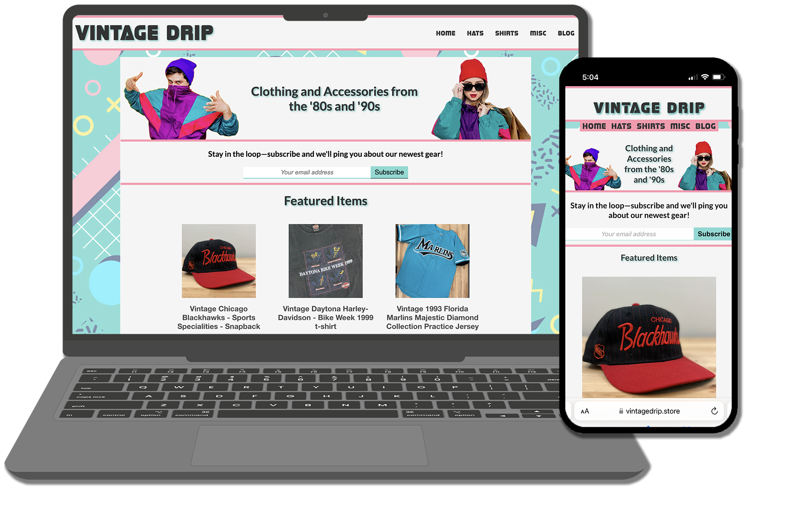

# Description

VintageDrip.Store is a fully responsive e-commerce site built in HTML, CSS, and ReactJS. The site uses the Shopify Buy-Button integration for payment processing and inventory management and a custom MailChimp integration for lead capture.

## Screenshots
Vintage Drip is fully mobile responsive. 

## Shopify Buy-Button

Shopify generates the embed code which allows you to present your products exactly how you want.

Quickly add a mobile friendly and secure shopping experience to your site. All the power of Shopify in a single button.

## MailChimp Integration

MailChimp Integration adapted from this blog post:
 
How to Integrate MailChimp Forms into a React Project
(https://www.thisdot.co/blog/how-to-integrate-mailchimp-forms-in-a-react-project)

https://github.com/clvalada/vintagedrip/blob/fb3c71cfbfc7c3941f00c4b6f30fe2ad4778f451/src/components/Newsletter.js

## Usage

Visit www.vintagedrip.store to begin shopping